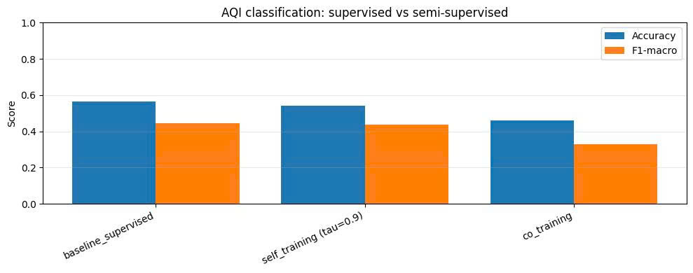
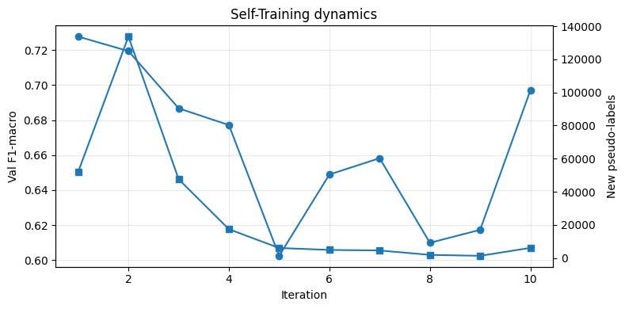
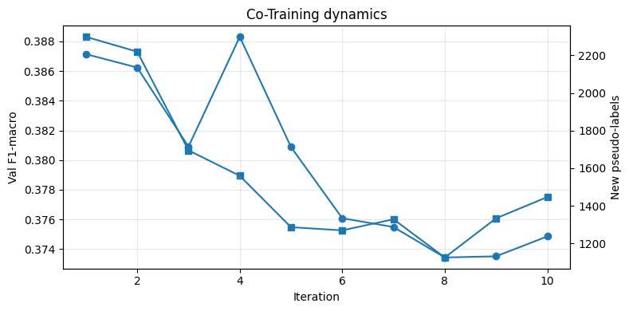
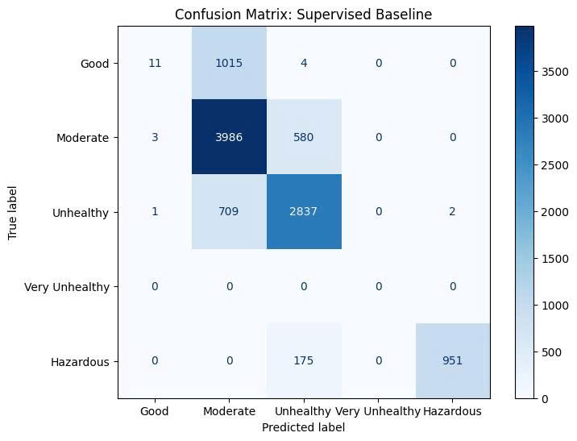

🌫️ AIR GUARD: Dự báo AQI Bắc Kinh bằng Học Bán Giám Sát
📌 Tổng quan dự án
Dự án tập trung vào bài toán phân loại chất lượng không khí (AQI) dựa trên nồng độ PM2.5 tại Bắc Kinh. Trong điều kiện thực tế nhãn dữ liệu khan hiếm (chỉ sử dụng 22.8% dữ liệu có nhãn) , nhóm đã áp dụng các kỹ thuật Học bán giám sát (Semi-supervised Learning) để tận dụng tối đa lượng lớn dữ liệu chưa gán nhãn.

⚙️ Quy trình xử lý (Modular Pipeline)
Dự án được xây dựng theo kiến trúc Pipeline đóng gói, đảm bảo tính nhất quán và chuyên nghiệp:

Data Ingestion: Nạp dữ liệu thô từ 12 trạm khí tượng.

Preprocessing: Xử lý giá trị thiếu, tạo Lag-features (24h) giúp mô hình nắm bắt tính chu kỳ của không khí.

Semi-supervised Engine: Đóng gói các thuật toán gán nhãn giả (Pseudo-labeling) trong thư mục src/.

Evaluation Pipeline: Đánh giá đa chiều qua Accuracy, Macro-F1 và Ma trận nhầm lẫn.

📊 Kết quả thực nghiệm & Phân tích
1. So sánh hiệu năng tổng thể
Mô hình Baseline (Supervised) được huấn luyện trên tập dữ liệu nhỏ có nhãn ban đầu để làm mốc so sánh.

Baseline (Supervised): Đạt F1-macro 0.444 và Accuracy 0.564. Đây là mô hình ổn định nhất.

Self-Training: Hiệu năng bám sát Baseline (0.436). Cho thấy khả năng tự học tốt từ dữ liệu không nhãn.

Co-Training: Đạt kết quả thấp hơn (0.330) do cơ chế trao đổi nhãn giữa 2 View đặc trưng còn khắt khe.

2. Diễn biến quá trình tự huấn luyện (Dynamics)
Phân tích diễn biến qua các vòng lặp (Iteration) để hiểu hành vi của mô hình.

Self-Training: Tại vòng lặp thứ 2, mô hình tự tin gán nhãn giả cho hơn 130,000 mẫu. Tuy nhiên, sự gia tăng quá nóng này gây ra hiện tượng nhiễu nhãn (Label Noise), khiến hiệu năng biến động ở các vòng sau.

Co-Training: Hai mô hình hỗ trợ lẫn nhau qua View 1 (Thời gian) và View 2 (Khí tượng). Số lượng nhãn mới tăng trưởng chậm nhưng ổn định (~1,500 - 2,300 mẫu/vòng).

3. Phân tích sai số (Confusion Matrix)
Ma trận nhầm lẫn giúp xác định các lớp AQI mà mô hình hay dự báo sai.

Mô hình dự báo rất chuẩn xác ở mức Moderate (3986 mẫu đúng) và Unhealthy (2837 mẫu đúng).

Thách thức nằm ở việc nhầm lẫn giữa mức Good và Moderate, do ranh giới nồng độ PM2.5 giữa hai mức này trong dữ liệu thực tế khá sát nhau.

📁 Cấu trúc thư mục

notebooks/: Chứa quy trình từ EDA, huấn luyện Baseline đến thực nghiệm Bán giám sát.

src/: Thư viện lõi chứa logic của Pipeline và thuật toán gán nhãn giả.

data/runs/: Lưu trữ kết quả metrics và dự đoán dưới dạng .json và .csv.
